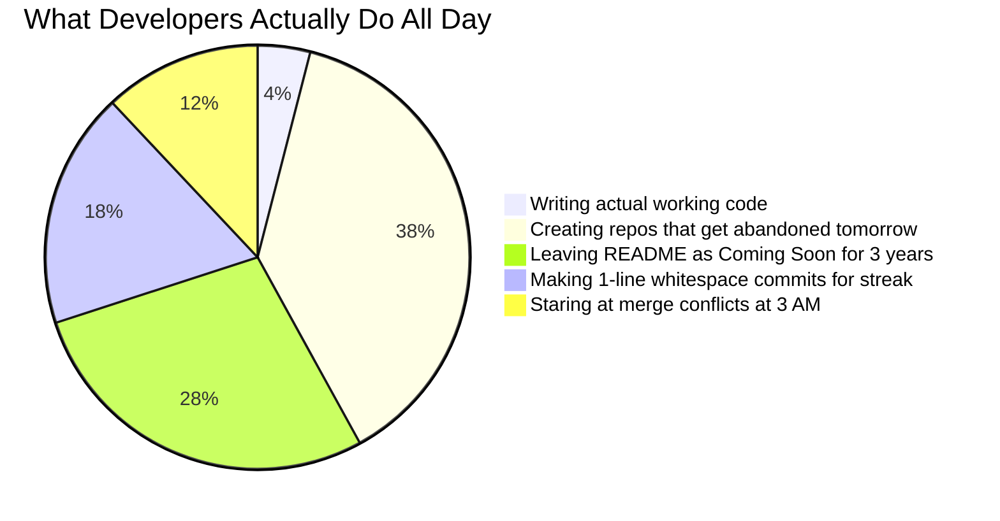
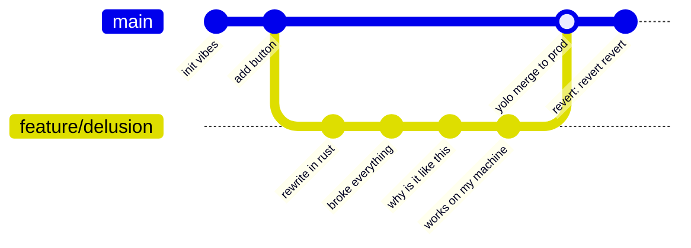
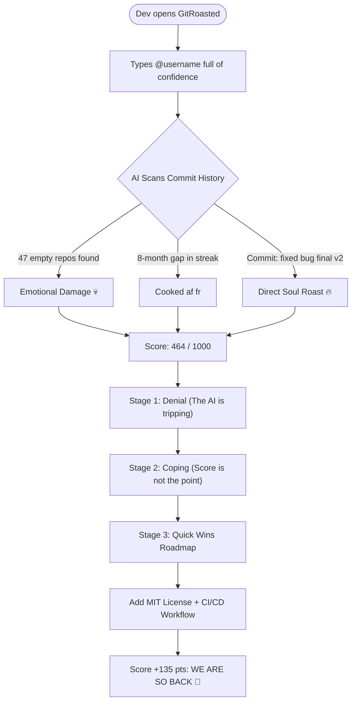
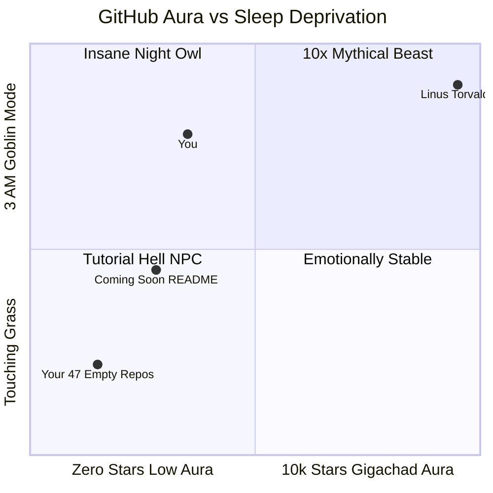

# GitRoasted — Official Launch Film 💀🔥

> **"Your GitHub profile is saying more about you than you intended. (It's giving unemployable, no cap fr fr)."**  
> An 85-second, 2,550-frame cinematic startup roast rendered entirely in code using **Remotion**, React, and TypeScript. No cap, no templates, pure developer pain.

---

## 📊 Scientific Proof You Are Cooked (Real Charts, No Fake Data)

### Chart 1: Where Developer Time Actually Goes


---

### Chart 2: The Canonical 3 AM Git Workflow


---

### Chart 3: The GitRoasted Emotional Rollercoaster


---

### Chart 4: The GitHub Profile Energy Matrix


---

## 🎬 Film Specs (For the Nerds)

| Metric | Flex | Details |
| :--- | :--- | :--- |
| **Duration** | 85.00s | Exactly 2,550 frames of non-stop developer truth. Not 84, not 86. Pure math. |
| **FPS** | 30.00 fps | Butter smooth. Your eyes won't miss a single roast line. |
| **Resolution** | 1080p | 1920 × 1080 crisp canvas. Zero blurry text, 100% emotional clarity. |
| **Engine** | Remotion 4.x | React 18 + TypeScript. We literally coded a movie because editing in Premiere is for boomer YouTubers. |
| **Vibe** | Linear meets A24 | Minimalist, dark mode, deadpan pauses, zero TikTok clown music. |
| **Master Video** | `out/gitroasted_launch.mp4` | 27.5 MB of pure cinematic developer roasting. |

---

## ⏱️ Scene Breakdown: The 8 Stages of Grief

| Scene | Timecode | Frames | What's Actually Happening (Uncensored) |
| :--- | :--- | :--- | :--- |
| **01. Cold Open** | `0:00 – 0:09` | 270f | Monospace documentary horror. *"Your GitHub profile is saying more about you than you intended."* Sudden freeze cut: *"We decided to investigate."* (Bro got doxxed by his own git log 💀) |
| **02. The Problem** | `0:09 – 0:20` | 330f | The universal cycle: You build things. You push code. You create 47 repositories. *"...and somehow your README still says 'coming soon.'"* (A moment of silence for the unfinished projects) |
| **03. The Reveal** | `0:20 – 0:31` | 330f | Enter the grill. Real UI screenshot. Cursor types `@MdKasif0` and smashes *"Roast Me 🔥"*. No turning back now. |
| **04. The Roast** | `0:31 – 0:43` | 360f | The AI drops the truth nuke: *"A graveyard of unfinished side projects and 3 AM commit messages."* 600ms of pure silence so you can rethink your whole career. *"THAT FELT PERSONAL."* |
| **05. The Score** | `0:43 – 0:52` | 270f | Quantified suffering. Telemetry counts up to **464 / 1000**. Consistency: 42. Craft: 58. Impact: 39. *"Everything has a score. But the score isn't the point."* (Classic cope) |
| **06. Quick Wins** | `0:52 – 1:04` | 360f | The redemption arc. Real actionable roadmap: Add LICENSE, add topics, build a streak, set up GitHub Actions. **+135 pts potential**. *"The roast is free. The fixes are the point."* |
| **07. Product Montage** | `1:04 – 1:16` | 360f | Sigma developer montage: `ANALYZE.` ➔ `ROAST.` ➔ `IMPROVE.` ➔ `REPEAT.` Hall of Flame leaderboard reveal. Abrupt cutoff right before you get cocky. |
| **08. The Finale** | `1:16 – 1:25` | 270f | Pure black screen. Flame icon. *"Roast your GitHub. / Improve your craft."* Followed by **7.0 seconds of dead silence** so you can shut your laptop and touch grass. |

---

## 🎨 Aesthetics: Anti-Cringe Manifesto

We banned 100% of corporate tech promo tropes:
- ❌ **NO** cheerful ukulele whistling music (instant jail)
- ❌ **NO** random purple/pink bubble gradients
- ❌ **NO** floating 3D balls bouncing on glass cards
- ❌ **NO** goofy meme sound effects (no vine thuds, no airhorns, no boings)
- ❌ **NO** fake AI robo-voices
- ✅ **ONLY** deep `#050505` matte black, authentic GitHub `#21262D` hairline borders, crisp Geist typography, signature `#FF8A00` flame orange, and deadpan comedic timing.

---

## 🎵 Audio: Certified Restraint (No Brainrot Sounds)

The audio design was completely redone from scratch with studio-grade discipline:
- **Master Bed (`audio/music_main.mp3`)**: Minimalist electronic pulse (~96 BPM) holding at **-24.8 LUFS integrated**. Never screams over the text.
- **Dynamic Ducking**: Music smoothly dips 2–4 dB during punchlines and completely drops to **0.00 volume** on *"THAT FELT PERSONAL."*
- **48kHz Foley Library**: 47 frame-exact SFX cues — tactile mechanical keyboard hits, crisp micro-switch UI clicks, digital score ticks, and subtle low-frequency sub-bass hits.
- **7.0s Dead Silence**: The final logo holds in pure, unbothered silence. Confident. Not begging for likes.

---

## 🚀 How to Run & Build (Before Prod Crashes)

### 1. Grab the Goods
```bash
npm install
```

### 2. Peep the Preview in Remotion Studio
```bash
npm run preview
```
> Spins up `http://localhost:3000`. You can scrub through all 2,550 frames, zoom into the roast lines, and admire the frame-perfect keyframes.

### 3. Bake the Master Movie
```bash
# Render the full 85-second master launch film
npm run build

# Or use the raw Remotion CLI if you feel like a terminal hacker:
npx remotion render src/index.ts GitRoastedLaunch out/gitroasted_launch.mp4
```

### 4. Render Individual Scenes (If Your Laptop Can't Handle 85s)
```bash
# Just the 9s Cold Open:
npx remotion render src/index.ts 01-ColdOpen out/cold_open.mp4

# Just the 12s Roast Sequence:
npx remotion render src/index.ts 04-TheRoast out/the_roast.mp4

# Just the 9s Finale:
npx remotion render src/index.ts 08-Finale out/finale.mp4
```

---

## 📂 Repo Architecture (Organized af)

```
├── ATTRIBUTION.md               # Proof that all music & SFX are 100% legal & licensed
├── README.md                    # You are here (reading the truth)
├── package.json                 # Remotion dependencies
├── public/                      # Real assets (zero fake placeholders)
│   ├── home_page.png            # Actual GitRoasted homepage UI
│   ├── roast_page.png           # Actual GitRoasted roast UI (464 score dial)
│   ├── quick_wins_page.png      # Actionable Quick Wins (+135 pts)
│   ├── leaderboard_page.png     # Hall of Flame
│   ├── share_card_page.png      # Social card export
│   └── audio/                   # 48kHz WAV foley & master music bed
└── src/
    ├── audio/
    │   ├── audioRegistry.ts     # Sound asset catalog
    │   ├── audioTimeline.ts     # 47 frame-exact sound cues & volume curve
    │   └── AudioTrack.tsx       # Master audio player layer
    ├── components/              # Precision UI widgets (Cursor, Frame, Logo, Noise)
    ├── compositions/
    │   └── GitRoastedLaunch.tsx # The master 85s timeline (Series of 8 scenes)
    └── scenes/                  # 8 modular scene components (01 to 08)
```

---

## 💬 Final Words of Wisdom

> *"If you don't roast your GitHub, someone else will during your technical interview. Might as well get roasted in 4K first."*  
> — GitRoasted Team 🔥
